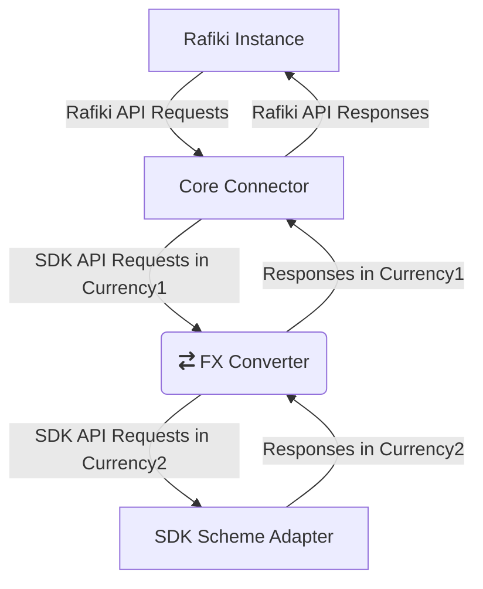

# [EXPERIMENTAL] Rafiki Core Connector

<!-- ACTION: REPLACE sdk-core-connector-rafiki-api-svc placeholders in this document -->
[](https://github.com/mojaloop/sdk-core-connector-rafiki-api-svc/commits/master)
[](https://github.com/mojaloop/sdk-core-connector-rafiki-api-svc/releases)
[](https://www.npmjs.com/package/@mojaloop/sdk-core-connector-rafiki-api-svc)
[](https://www.npmjs.com/package/@mojaloop/sdk-core-connector-rafiki-api-svc)
[](https://circleci.com/gh/mojaloop/sdk-core-connector-rafiki-api-svc)

[EXPERIMENTAL] An initial implementation of Rafiki Core Connector. It connects the Rafiki system to SDK Scheme Adapter.

`This repository is still under development`

## Contributing

Refer to [CONTRIBUTING.md](./CONTRIBUTING.md) for information on how to contribute, committing changes, releases and snapshots.

---

## Overview

This repository is an initial implementation for the Rafiki core connector.
The Rafiki Core Connector sits between Rafiki instance and SDK (Or optional FX Converter).

## Block diagram



---

## Pre-requisites

### Install dependencies

```bash
npm install
```

## Build

Command to transpile Typescript into JS:

```bash
npm run build
```

Command to LIVE transpile Typescript into JS live when any changes are made to the code-base:

```bash
npm run watch
```

## Run

```bash
npm start
```

## Tests

```bash
npm test
```